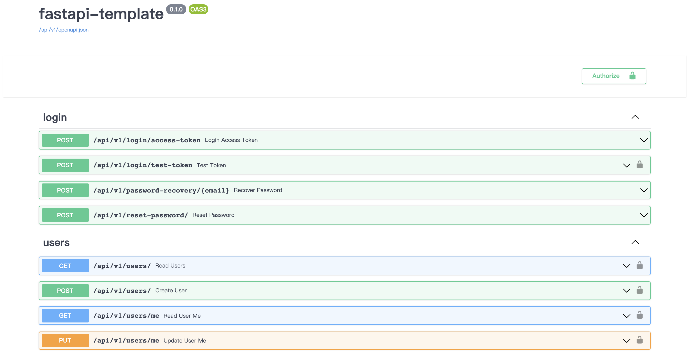

# FastAPI Template

A fastapi template with mysql.

Ref: https://github.com/tiangolo/full-stack-fastapi-postgresql


## Usage

1.Clone the project.

```shell
git clone https://github.com/DavidIans/fastapi-template.git
cd fastapi-template
```


2.Set up env, change the settings.

> You should create database `fastapi` in advance or else.

`vim .env`

```
PROJECT_NAME=fastapi-template
FIRST_SUPERUSER=daiwei233@outlook.com
FIRST_SUPERUSER_PASSWORD=fastapi

MYSQL_SERVER=127.0.0.1:3306
MYSQL_DB=fastapi
MYSQL_USER=root
MYSQL_PASSWORD=password

SERVER_HOST=http://0.0.0.0
SERVER_NAME=fastapi-template

EMAILS_FROM_NAME=no-reply@fastapi.com
```


3.Install depends.

```shell
pip3 install -r requitments.txt
```


4.Start project.

```shell
uvicorn app.main:app --reload
# or 
uvicorn app.main:app --reload --host 0.0.0.0 --port 9527 --workers 4 --log-config log.yml --use-colors
```

and see: http://0.0.0.0:9527/docs




## Project structure

```
app
├── app/api
│   └── app/api/api_v1
│       ├── app/api/api_v1/endpoints - web routes.
│       └── app/api/api_v1/errors    - error handler.
├── app/core                         - application configuration.
├── app/crud                         - crud.
├── app/db                           - db config.
├── app/email-templates              - email templates.
├── app/models                       - sqlalcheby models.
├── app/schemas                      - schemas for using in web routes.
└── app/tests                        - unitests.
```
